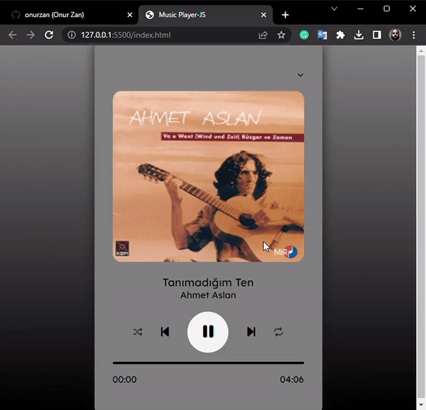

<h1>Spotify Music Player</h1>

<h2>Used Tech's</h2>

HTML5, CSS3, JavaScript

<h3>Intention</h3>

The main purpose of this project is to perform all the tasks that a music player normally does (play, pause, next song, previous song and shuffle) with a preset playlist. The song list is located in the top right pop-up window and the music player plays the selected song.

